<center></center>
<br>

<center><h1> Git / GitHub </h1></center>
<p>Clarusway</p>
<br>

# What is Git?

- **Git** is an open source distributed **version control system**
- Tracks and records changes to files over time (**versioning**)
- Can retrieve previous version of files at any time (**time travel**)
- Can be used locally, or collaboratively with others (**teamwork**)
- Contains extra information such as date, author, and a message explaining the change 
- Compare and Blame
     - What changed
     - When it changed
     - Why it changed
     - Who changed it


## Repository

- Repositorie contains a collection of files of various different versions of a Project. A Git repository is the .git/ folder inside a project. This repository tracks all changes made to files in your project, building a history over time.

# Configuration

- git config (Get and set configuration variables that control all facets of how Git looks and operates.)

```
git --version
```
- Check the config setting

```
git  config --list 
```
- Set the user name

```
git config --global user.name “User name” 

git config user.name “User name” 
```
- show just the user name
```
git config --global user.name
```
- Set the user email

```
git config --global user.email “tyler@clarusway.com” 
```
-  Set the default editor

```
git config --global core.editor Vim 
```

- Set up an alias for each command:

```
git config --global alias.co checkout
git config --global alias.br branch
git config --global alias.ci commit
git config --global alias.st status
```
<br> <br><br>
# Create a Local repository

- Create a local repository
```
git init

git init <new-folder-name>
```
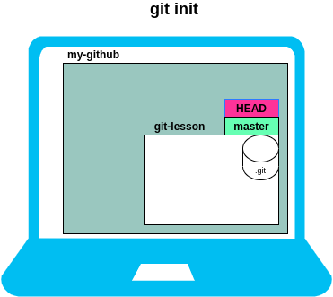


- Delete a git repository
```
rm -rf .git
```

# Workflow

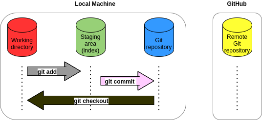

- Display the state of the working directory and the staging area
```
git status
```

- Add a file to staging (Index) area
```
git add  filename		
git add .        
```
- remove a file from staging area
```
git rm --cached filename 
```
- Record or snapshots the file permanently in the version history with a message.

```
git commit  -m “message”   
git commit  -am “message” 
```
- Display the most recent commits and the status of the head
```
git log 
git log --pretty=oneline 
git log --oneline 
```
- Change the most recent commit message
```
git commit --amend -m “message”
```

- use graph

```
git log --graph
```

- switch to commit

```
git checkout <commitID>
```

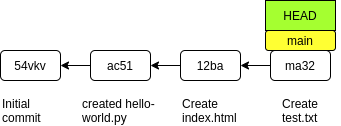

<br><br><br><br><br><br><br><br><br><br><br>

# Branches


- create a new branch

```
git branch <new-branch-name>
```
- show the branches
```
git branch      
git branch -r   
git branch -a       
```
- HEAD - switch to a particular branch
```    
git checkout <branch-name>    
```

- Create a new branch and switch to it
```
git checkout -b <new-branch-name>
```
- Delete a Branch

```
git branch -d <new-branch-name>       
git branch -D <new-branch-name>      
```
<br>

- Delete a remote Branch

```
git push origin -delete
```
- Rename Branch
```
git branch -m
```
## Merge the branches
```
git merge <new-branch-name> 
```
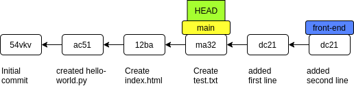

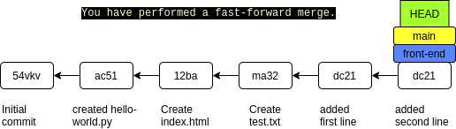

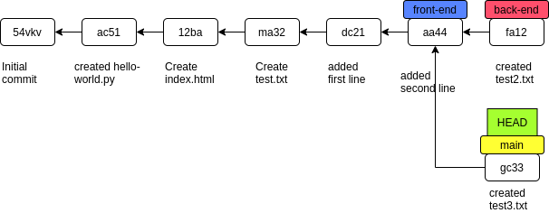

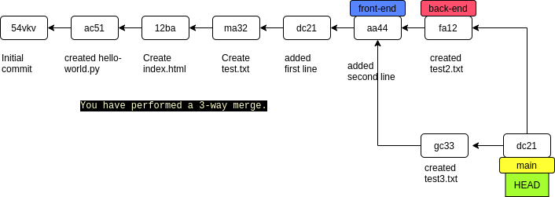


- **Merge conflicts** happen when you merge branches that have competing commits, and Git needs your help to decide which changes to incorporate in the final merge.

# Rebase (optional and do not recomend to do that )

- Apply a sequence of commits from distinct branches into a final commit.

  - history becomes linear   
  - rewrites history
  - doesn't keep entire history of all commits

```
git rebase <branch>
```
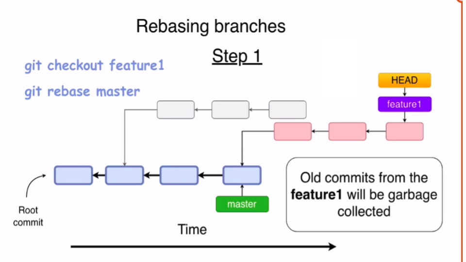

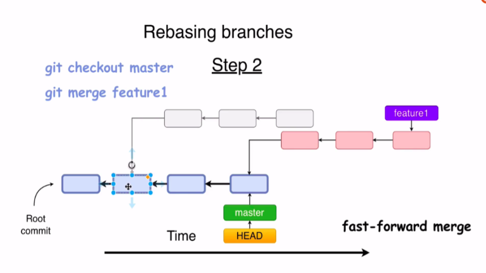

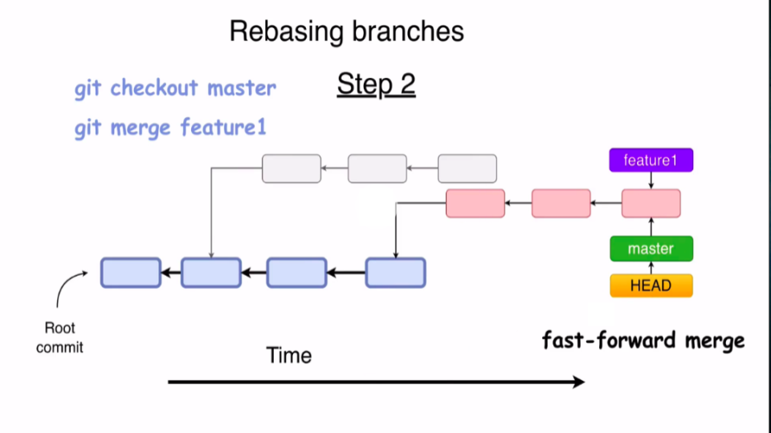

 # Remote Repository (GITHUB)
## Create a remote repository


- Private-public

- README.MD

- gitignore

## Remote repo workflow

- Check the configuration of the remote server:
```
 git remote -v
```
- Transfer the commits from your local repository to a remote server

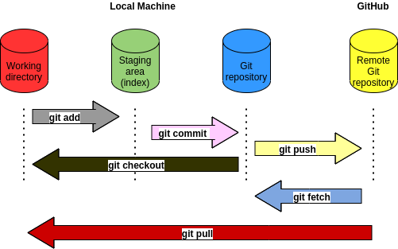

```
git push <URL> <branch> 
```
- To add a new remote

```
git remote add origin <URL> 
```
```
git push -u origin <branch-name> 
```

```
git push
```
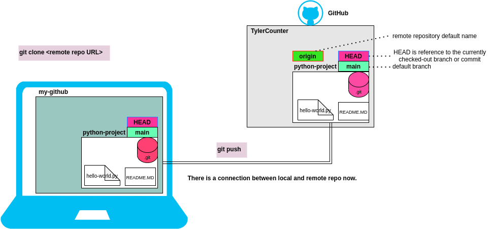


- Fetch the remote repository
```
git fetch <repository Url> 
```
- Fetch all the branches simultaneously

```
git fetch -all
```

- Synchronize the local repository
```
git fetch origin 
```
- to see the changes in working directory
```
git merge origin/master
```
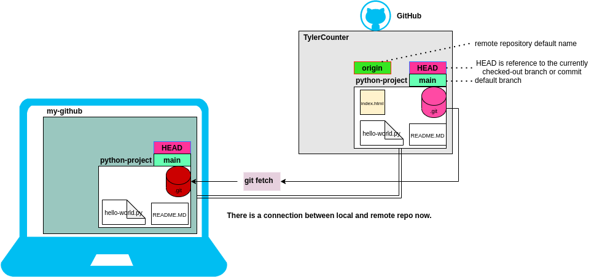


- **git diff**

- Track the changes that have not been staged: 
```
git diff
```

- Track the changes between two commits:
```
git diff <commit-id> <commit-id>
```
Track the changes between two commits:
```
git diff < branch 2>
```


## Pull 

- pull = fetch + merge

```
git pull
```

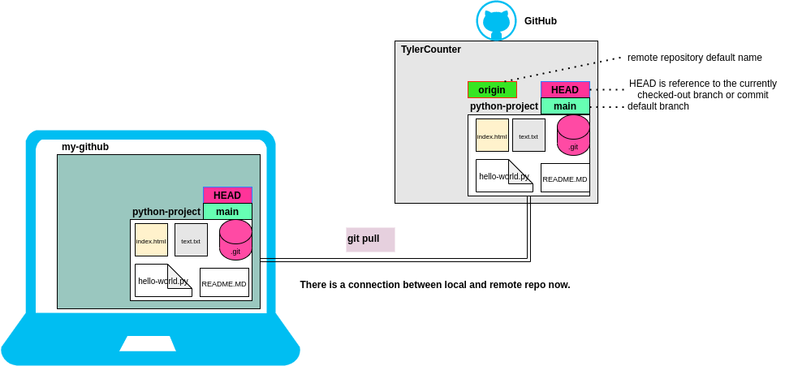


## Make a local copy of the server repository

```
git clone URL
```

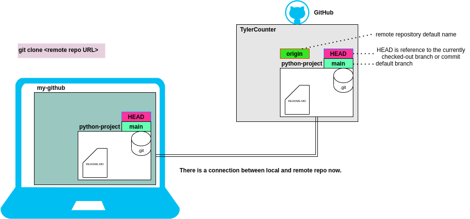

<br>

## Forking

- Creating a “fork” is producing a personal copy of someone else's project. Forks act as a sort of bridge between the original repository and your personal copy. You can submit Pull Requests to help make other people's projects better by offering your changes up to the original projec


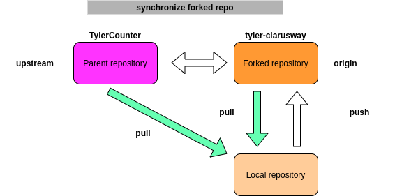

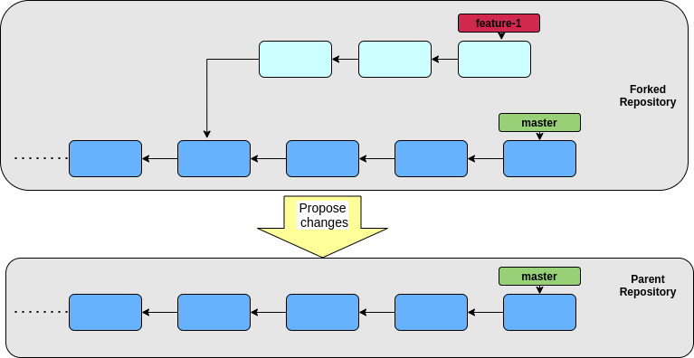


## Pull request

- Github’s feature not Git’s feature
- It allows you to contribute to other projects
- Pull Requests (PR) let you tell others about changes you've pushed to a branch in a repository - on GitHub
- You create a pull request to propose and collaborate on changes to a repository. These changes are proposed in a branch, which ensures that the master branch only contains finished and approved work.

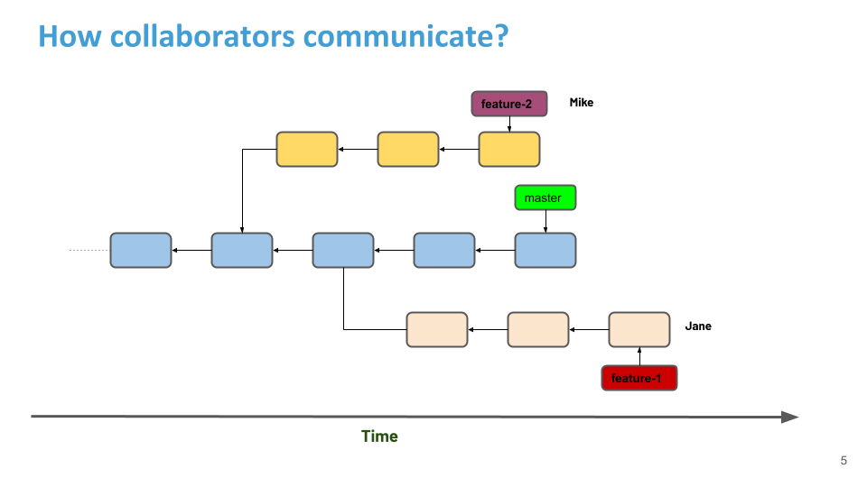


**<p align="center">&#9786; Thanks for your Attention &#9997;</p>**

<p>Clarusway</p>