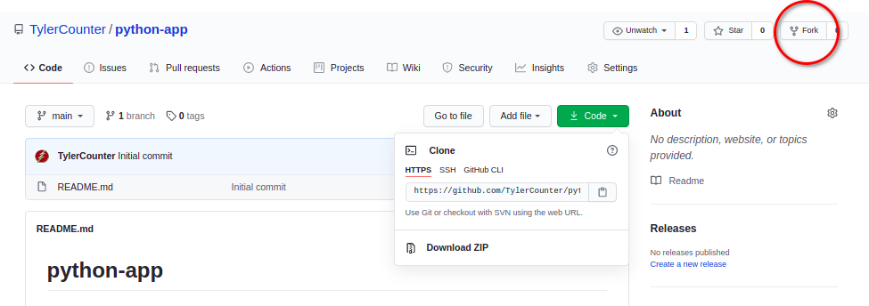
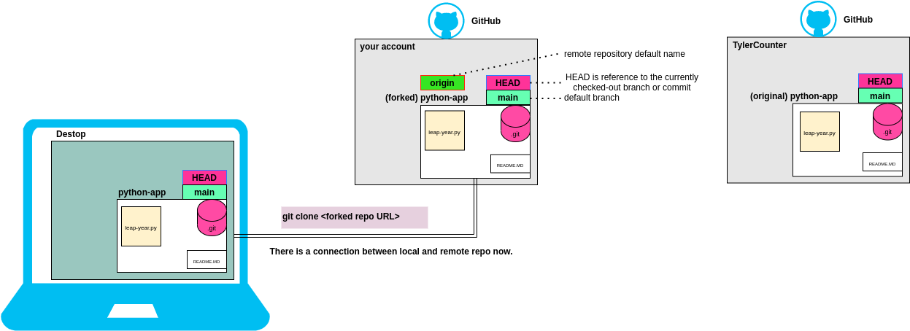
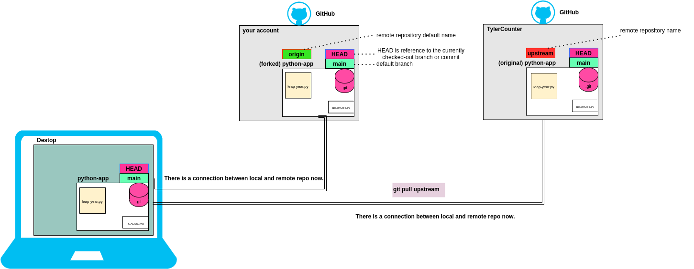
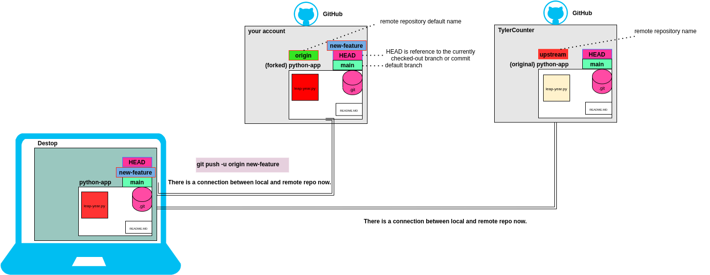
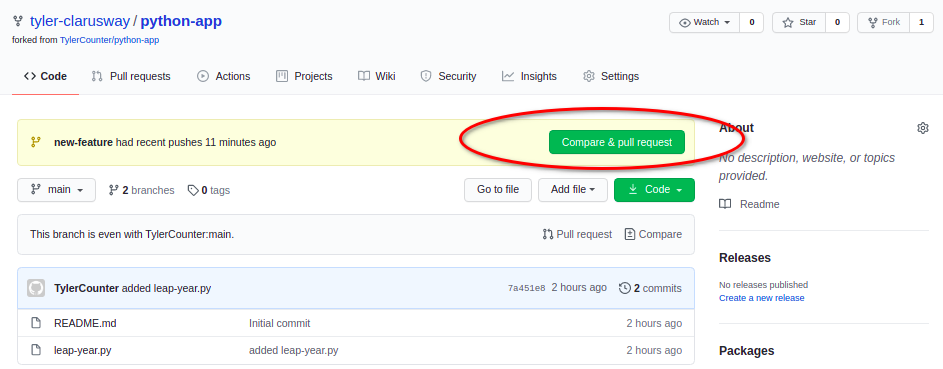
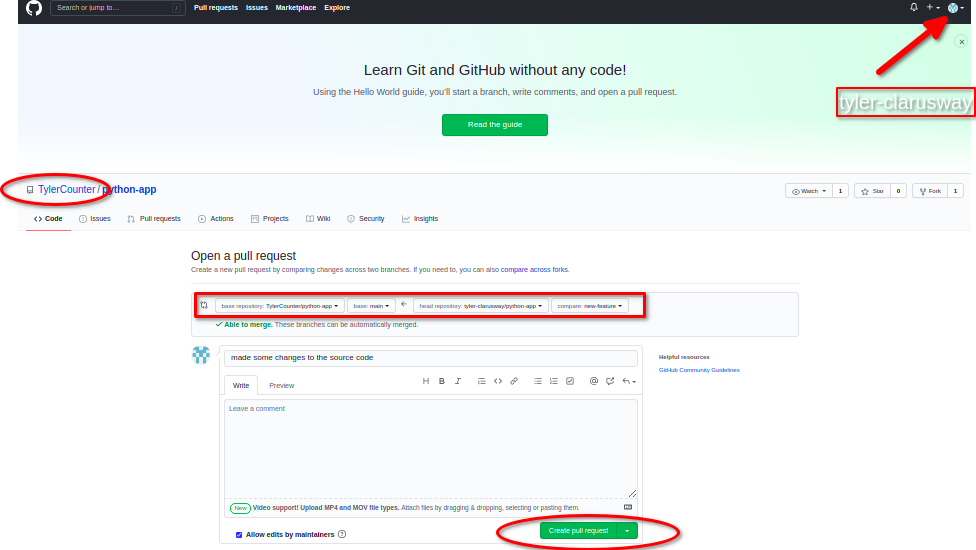
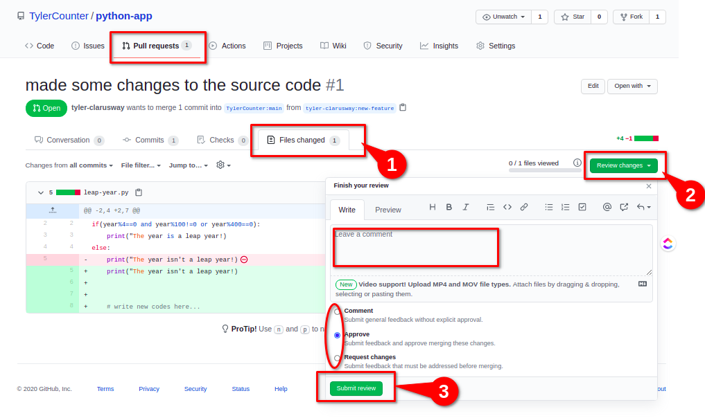
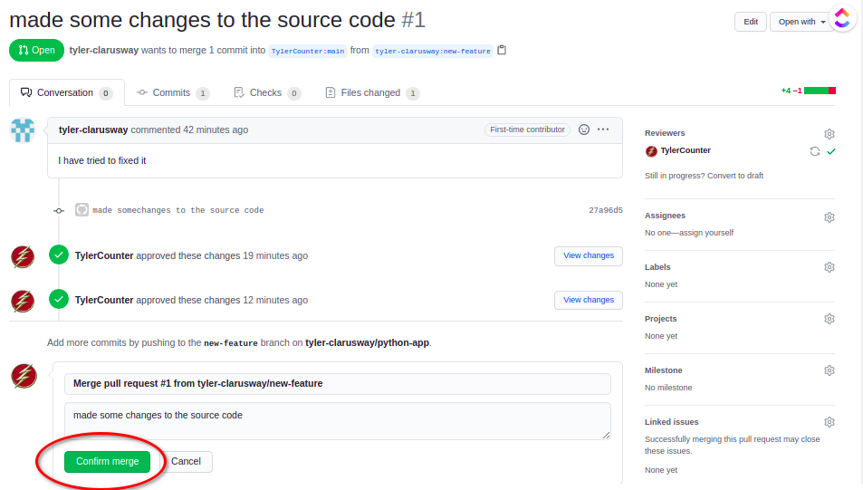

<center></center>
<br>

<center><h1> Git Hands on-2 </h1></center>
<p>Clarusway</p>
<br>


 
# Part 1

## Forking a project

The first thing we want to do is to fork an existing repository on GitHub.

### What is forking?

Forking a repository is great! You can make all of the mistakes you want without affecting the original project, or you may want to take the project in a different direction.

What is forking generally used for? Most of the time, people fork projects to propose changes to someone else’s project.

So how do I do this “fork” thing anyway? Forking is a simple process of finding the repository you want to fork on GitHub in the top right corner, click on Fork.  

(fork follwowing repository: https://github.com/TylerCounter/python-app.git)



<br><br><br>

- How to propose changes to a project. The workflow is something like this:

1. Fork the repository

2. Create a fix (commit changes)

3. Submit a pull request to the original project

<br>

# Part 2

To get started with Git, we have to do two things, first of all let's go ahead and configure Git with our name and email. 

This is to identify who has done what on GitHub.
```
git config --global user.name "TylerCounter"
git config --global user.email "tyler@clarusway.com"

```
(naturally, if you're doing this on your local machine then you might already have this config stuff done)

Secondly, we need to create a local repository, we can do that by running the init command. ```git init```, or the other way, we can **clone** a existing repository from GitHub. 
 

# Part 3

## Cloning

The cloning command is awesome, not only does it get the repository, it also sets up the remote tracking for all of the branches. 

- We are going to use the clone command to get our newly forked repo:

```
git clone <forked-repo-URL>
```



<br><br>

# Part 4

## Make your changes 1.

**Branching** is a way for you to work on different features in the code at the same without destroying the **master/main** branch. 

The basic idea is to create a feature branch, do some work, then integrate it into the **master/main** branch. You can see a branch as a clean slate where you can do whatever you want without ruining someone elses work.

- Let's checkout the branches that exist, we can do that by running the command 

```
git branch
```
The only branch for now is the **main** branch.

- You can create a new branch by typing ```git branch <new-branch-name>``` and then switch to it by running ```git checkout <new-branch-name>``` OR we can just type ```git checkout -b <new-branch-name>``` to do the same thing and life a little easier. Go ahead and create a branch with the name "**new-feature**".

```
git checkout -b new-feature
```


## Make your changes 2

Now that we are on our feature branch, we are going to change one of the functions in our **leap-year.py** to use an iterative method because it is not working now, stage the changes and commit them to our feature-branch. 

- Go ahead and open the **leap-year.py** in the text editor and change it.

- To check the status of our work so far, run the 

```
git status
``` 

- Now you can stage the file by running the add command

```
git add leap-year.py
```

Examples;

- Adds all changes files:
```
git add .
```

- Adds content from all *.txt files under Documentation directory and its subdirectories:
```
git add Documentation/\*.txt
```
- Considers adding content from all git-*.sh scripts:

```
git add git-*.sh

```

# Part 5

## Get latests changes from original repository.

Now there may have been some changes that are of interest in the original repository that we've forked from, let's take a look and get them.
Specify a new remote **upstream** repository that will be synced with the fork 

```
git remote add upstream https://github.com/TylerCounter/python-app.git

```




- Verify the new upstream repository you've specified for your fork. 

```
git remote -v
```

- Download the all changes from original repository. 

```
git pull upstream main

```
<br><br>

# Part 6

## Push!

Run the following command to push what you've done to the new-feature branch of your fork! (but it won't work)
```
git push origin

```
**fatal: The current branch new-feature has no upstream branch.**

- To push the current branch and set the remote as upstream, use
```
git push --set-upstream origin new-feature
```
or shortcut;

```
git push -u origin new-feature
```

 
# Part 7

## Pull Request

This is the moment you've been waiting for, to make a pull request. 

This is were you tell the owner of the original reposity that you forked from that you would like them to merge your changes into their repository. You could say that you send them a request to pull the your work. Whether or not they will accept, or even write back, is another question. They might not even know who you are.

How do I do it?

This is an operation performed on github. 

- Go to the forked repository (in your own account).

- Click the big, friendly, green button that says "**compare & pull request**".

(Note: you can alsa reach "pull request" button if click "branches" button")




Now, find the text that says "compare across forks" as part of the sentence right underneath the large "Open a pull request". <br>
It should say something like this:

**base repository: owner/repo-name base:branch <-- head repository:your-name/repo-name compare:branch**

Write something nice about it so that the owner knows what you (at least tried to ) accomplish.

- Then click the "Create pull request" 




- Wait for the answer of the owner of the original repo. 
 
- Owner of the original repo:
  - Click "**Files changed**".
  - Click the "**Review changes**"

  


  - Owner can have 3 options "comment", "Approve" or "Request changes".

  - Click "**submit review**"

  - Then click "**Merge pull request**"

  - Finally "**Confirm merge**"

  

<br>

## Perfect, you have just contributed someone else's project :)


